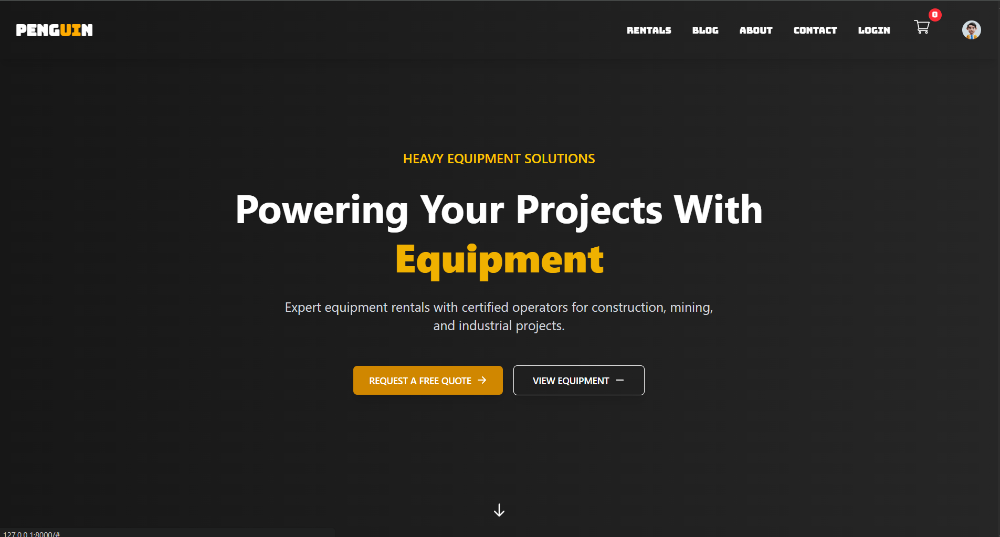

# Template1

A modern Laravel + Livewire web application project, designed for rapid development of feature-rich web solutions. The name 'Template1' was chosen for convenience, but this is a complete project including user authentication, job processing, mailing, equipment rental, blogging, and more.

## Features

## Screenshots

<div align="center">
	
	
	
	
</div>

## Getting Started

### Prerequisites

-   PHP >= 8.1
-   Composer
-   Node.js & npm

### Installation

```bash
# Clone the repository
git clone https://github.com/barsch123/template1.git
cd template1

# Install PHP dependencies
composer install

# Install Node dependencies
npm install

# Copy environment file
cp .env.example .env

# Generate application key
php artisan key:generate

# Run migrations
php artisan migrate

# (Optional) Seed the database
php artisan db:seed

# Build assets
npm run build

# Start the development server
php artisan serve
```

## Project Structure

-   `app/` - Application core (Controllers, Jobs, Livewire, Mail, Models, Providers, View Components)
-   `resources/views/` - Blade templates
-   `routes/` - Route definitions (`web.php`, `auth.php`, `console.php`)
-   `database/` - Migrations, factories, seeders
-   `public/` - Public assets
-   `tests/` - Will be added soon

## Livewire Cart Example

The `CartItems` Livewire component manages cart operations using session storage. It supports adding, removing, selecting, and clearing items with instant UI updates.

## Contributing

Pull requests are welcome! For major changes, please open an issue first to discuss what you would like to change.

## License

This project is open-source and available under the [MIT License](LICENSE).

---

> Made with ❤️ using Laravel & Livewire
